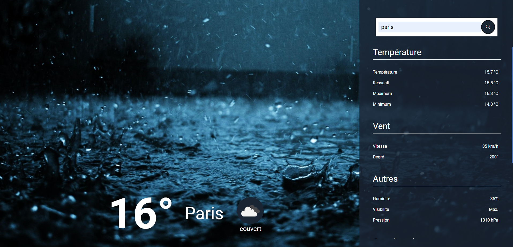

# Projet Météo

Ce projet a pour but de m'exercer à comminuquer avec une API en réalisant une application de météo simple. L'application affiche les données météorologiques actuelles d'une ville donnée.

## Prérequis
Pour pouvoir utiliser ce projet, vous aurez besoin de :

- Un navigateur web (Google Chrome, Mozilla Firefox, Safari, etc.)
- Un éditeur de code (Visual Studio Code, Sublime Text, etc.)

## Installation
Pour utiliser ce projet, vous pouvez télécharger le code source en cliquant sur le bouton "Clone or download" puis sur "Download ZIP". Vous pouvez également cloner le dépôt en utilisant Git en tapant la commande suivante dans votre terminal :

```
git clone https://github.com/Remi-Debu/Meteo.git
```

## Utilisation
- Pour ouvrir l'application, ouvrez le fichier index.html avec votre navigateur web. 
- Vous devriez voir s'afficher l'interface de l'application de météo
- Saisissez le nom d'une ville dans le champ de recherche et cliquez sur le bouton de recherche pour afficher les données météorologiques actuelles. 
- Si vous souhaitez modifier le code, ouvrez le fichier avec votre éditeur de
code.

## Crédits
- Les données météorologiques sont fournies par l'API OpenWeatherMap 
- Ma clé API est disponible dans le code.

## Aperçu

